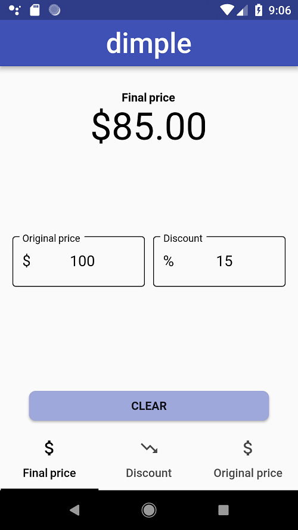
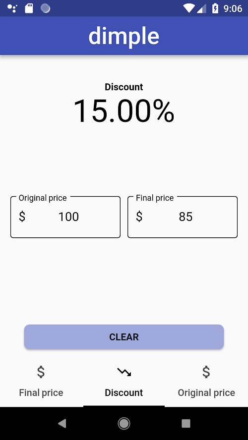
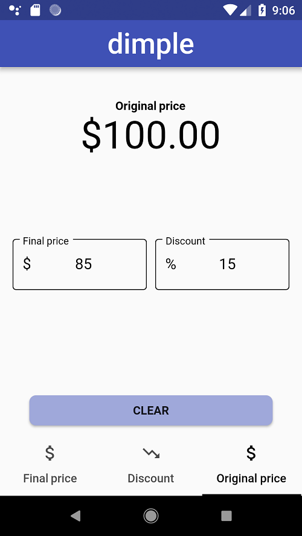

# dimple

Dimple is an application made with Flutter which allows the user to perform calculations related to discounts.

My aim is to create a simple user interface composed by 3 view tabs:

  -Final price of a product after a discount.
  
  

  -Discount applied from the original and final prices data.

  

  -Original price of a reduced price product.

  
